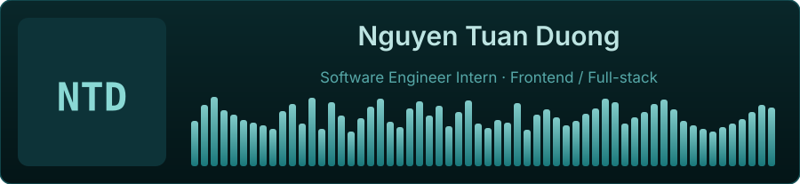
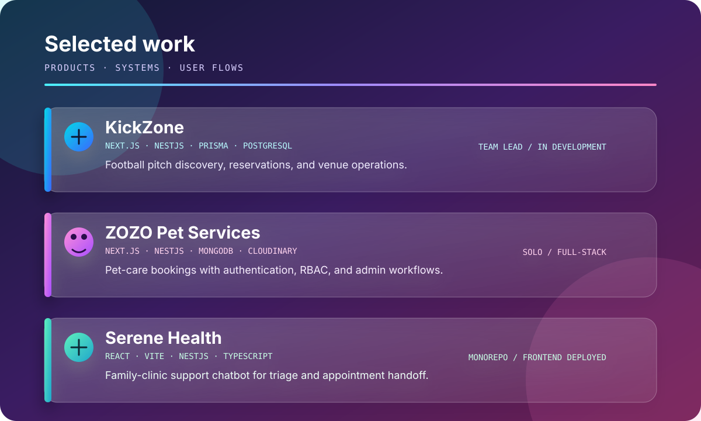
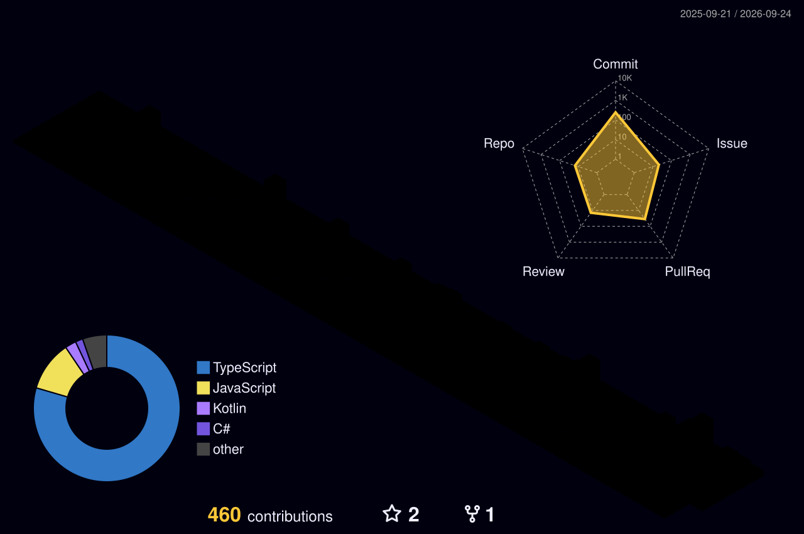
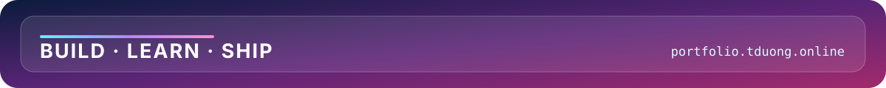

<!-- Visual direction adapted from Glassmorphism Hero in https://github.com/beydemirfurkan/awesome-github-profile (MIT). -->

  

  <a href="https://portfolio.tduong.online">Portfolio</a> ·
  <a href="https://github.com/duong-vn">GitHub</a> ·
  <a href="mailto:duongnguyenhust05@gmail.com">Email</a>

## About Me

I build responsive, reliable web applications across frontend and backend systems, focusing on TypeScript, React, Next.js, and NestJS. Currently pursuing Information Technology in the Vietnam-Japan Program at Hanoi University of Science and Technology (HUST).

> [!TIP]
> **Current focus:** Full-stack web development with Next.js, NestJS, and PostgreSQL.
>
> **Looking for:** Software Engineer Intern, Frontend, or Full-stack opportunities.

## Experience & Education

- **Frontend Developer Intern** · Sun* Vietnam *(Jul 2026 – Aug 2026)*
- **Frontend Intern / Trainee** · JVB Vietnam *(Oct 2025 – Dec 2025)*
- **Information Technology, Vietnam-Japan Program** · Hanoi University of Science and Technology (HUST) *(2023 – Present)*

## Selected Work

  

### [KickZone](https://github.com/duong-vn/KickZone) · Football Pitch Booking Platform

> Next.js · NestJS · Prisma · PostgreSQL · Supabase Auth

Team lead for a full-stack foundation for pitch discovery, schedule reservations, and venue operations. Database architecture, authentication, and core business modules are in development.

[Live demo](https://kick-zone-web.vercel.app) · [Repository](https://github.com/duong-vn/KickZone)

### [ZOZO Pet Services](https://github.com/duong-vn/Pet-Service-Website) · Pet-care Booking Platform

> Next.js · NestJS · MongoDB · Tailwind CSS · Cloudinary

Solo full-stack booking application for grooming and pet-care services. Includes Google OAuth and local login, role-based access control, appointment workflows, an admin dashboard, email notifications, and responsive dark-mode UI.

[Live demo](https://zozo-sigma.vercel.app) · [Repository](https://github.com/duong-vn/Pet-Service-Website)

### [Serene Health](https://github.com/duong-vn/Serene-Health) · Family-clinic Support Chatbot

> React · Vite · NestJS · TypeScript

Monorepo for initial health assessment, triage guidance, doctor handoff, and appointment support. Frontend is deployed; backend remains a foundation.

[Live demo](https://serene-health-web.vercel.app) · [Repository](https://github.com/duong-vn/Serene-Health)

## Contribution Graph

  

Updated weekly from public GitHub contributions.

## Tech Stack

- **Languages:** TypeScript, JavaScript, SQL
- **Frontend:** React, Next.js, Tailwind CSS, Vite
- **Backend:** Node.js, NestJS, Express.js, REST APIs
- **Data & tools:** PostgreSQL, MongoDB, SQL Server, Prisma, Docker, Git, GitHub Actions
- **Testing:** Jest, `ts-jest`, `@nestjs/testing`, Supertest

## Connect

- Portfolio: [portfolio.tduong.online](https://portfolio.tduong.online)
- Email: [duongnguyenhust05@gmail.com](mailto:duongnguyenhust05@gmail.com)

  

Visual direction adapted from <a href="https://github.com/beydemirfurkan/awesome-github-profile">awesome-github-profile</a> (MIT).

